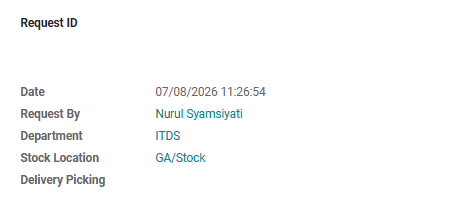

#  Alur Pembuatan Asset GA

Halaman ini menjelaskan langkah-langkah standar pendataan untuk mengelola dan mengatur aset-aset statis *Asset GA*.

## 1. Membuat Data Asset GA

1. Masuk ke modul **Asset GA** > **Confirm**.
2. Klik tombol **Create** di pojok kiri atas halaman.
3. Sistem akan otomatis menarik nama yang mengajukan dan department nya.
4. Pilih nama sales yang menawarkan ke outlet tersebut pada kolom **Salesperson**.

<em>Gambar 1 : Tampilan pengisian form pada GA Request.</em>

---

## 2. Pengisian Produk

Pada tab **Item  Details**  masukkan product yang akan diajuan :

1. Klik **Add a line**.
2. Pilih produk dari daftar *dropdown*.
3. Masukkan jumlah produk pada kolom **Qty**.
4. Sistem akan otomatis menarik categori produk tersebut.
5. Isi penjelasan product tersebut digunakan untuk apa pada kolom **Purpose/Description**.
5. Kemudian klik **Save**

<em>Gambar 2 : Tampilan pengisian produk pada tab Item Details.</em>

---

## 3. Menunggu Approval Atasan

Pada state **Approved** yang akan menyetujui pengajuan yaitu *Atasan* dari masing-masing yang mengajukan sesuai hierarki employee dengan mengecek kebenaran data nya dan jika sudah sesuai maka klik tombol **Approve**.

---

## 4. Menungggu Proses Ketersediaan Produk

Pada state **In Progreess**  maka Team GA akan memproses pengajuan produk tersebut dan menyiapkan produk yang diminta untuk diberikan kepada yang mengajuan dengan memindahkan state menjadi **Ready**.

1. Team GA akan menyiapakan produk yang  telah diajukan.
2. Jika produk tidak tersedia maka hapus atau ganti dengan produk yang lain pada pilihan **Item name** sesuai dengan persetujuan yang mengajukan produk tersebut.
3. Setelah produk sudah disiapkan semua maka klik tombol **Ready**.
4. Tunggu sampai yang mengajuan sudah menerima produk tersebut.

## 📝 Referensi Tambahan

### SOP Harian (Checklist)
* <input type="checkbox"> **Pastikan Produk yang diajukan** sudah sesuai dan benar.
* <input type="checkbox"> **Memastikan Quantity sesuai kebutuhan** sudah sesuai dan benar.

### Fitur Berdasarkan Hak Akses
=== "User"
    - Dapat membuat *GA Request* baru dan dapat melihat data masing-masing user pada modul.
    - Dapat melakukan action **Received** ketika sudah menerima produk yang diajukan untuk memindahkan status *Ready* menjadi *Received*. 

=== "Approver"
    - Dapat melihat data user yang dibawahi masing-masing user pada modul.
    - Dapat melakukan action untuk memindahkan status *Requested* menjadi status *Approved*.

=== "Admin"
    - Dapat membuat *GA Request* baru dan dapat melihat keseluruhan data pengajuan pada modul.
    - Dapat melakukan action untuk memindahkan status *In Progress* dan *Ready* ketika akan memproses pengajuan dan sudah siap diberikan kepada yang mengajukan.