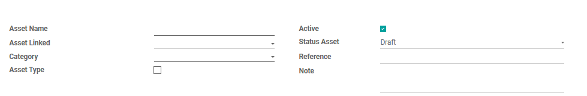

#  Alur Pembuatan Asset GA

Halaman ini menjelaskan langkah-langkah standar pendataan untuk mengelola dan mengatur aset-aset statis *Asset GA*.

## 1. Membuat Data Asset GA

1. Masuk ke modul **Asset GA** > **Asset** > **Confirm**.
2. Klik tombol **Create** di pojok kiri atas halaman.
3. Masukkan nama asset pada kolom **Asset Name** dan pilih category asset tersebut pada kolom **Category**.
4. Masukkan nomor reference pada kolom **Reference** dan catatan pada kolom **Note** jika diperlukan.
5. Ceklis **Asset Type** apabila asset tersebut merupakan barang elektronik.
6. Apabila asset tersebut sudah tidak digunakan lagi maka matikan ceklis pada kolom **Active**.

<em>Gambar 1 : Tampilan pengisian form pada Asset GA.</em>

---

## 2. Pengisian Asset kendaraan

Pada informasi **Vehicle**  masukkan informasi kendaraan yang merupakan aseet perusahaan, apabila asset tersebut bukan merupakan kendaraan maka bisa lewati langkah ini :

1. Pilih pembuatan kendaraan dari daftar *dropdown* pada kolom **Vehicle Make**.
2. Pilih model kendaraan dari daftar *dropdown* pada kolom **Vehicle Model**.
3. Masukkan nomor model pada kolom **Model No** dan nomor plat kendaraan pada kolom **Vehicle License Plate**.
4. Pilih tipe dan warna kendaraan dari daftar *dropdown* pada kolom **Vehicle Type** dan **Vehicle Color**.
5. Pilih kota pendaftran kendaraan tersebut dari daftra *dropdown* pada kolom **Registration State**.

<em>Gambar 2 : Tampilan pengisian asset kendaraan.</em>

---

## 3. Pengisian Asset Elektronik

Pada informasi **Electronic**  masukkan informasi elektronik yang merupakan aseet perusahaan, apabila asset tersebut bukan merupakan elektronik maka bisa lewati langkah ini :

1. Masukkan nama brand elektronik tersebut pada kolom **Brand**.
2. Pilih tipe elektronik dari daftar *dropdown* pada kolom **Type**.
3. Masukkan nomor serial elektronik pada kolom **Serial**.
4. Apabila merukan tipe *Leptop* atau *PC* maka masukkan informasi nomor **Motherboard**, **Processor**, **RAM**, **Disc/Memory**, dan **VGA Card**.
5. Masukkan keterangan/catatan dari Team IT mengenai elektronik tersebut pada kolom **Note IT**.

<em>Gambar 3 : Tampilan pengisian asset elektronic.</em>

---

## 4. Pengisian Informasi Pembelian Asset

Pada tab **Detail Purchase**  masukkan informasi mengenai pembelian asset :

1. Pilih nama vendor pembelian asset dari daftar *dropdown* pada kolom **Partner**.
2. Pilih tanggal pembelian asset pada kolom **Purchase Date**.
3. Masukkan harga pembelian asset pada kolom **Gross Value**.
4. Apabila ada garansi maka masukkan tanggal garansi asset pada kolom **Warranty**.

<em>Gambar 4 : Tampilan pengisian pembelian asset pada tab Detail Purchase.</em>

---

## 5. Pengisian Informasi Pengguna Asset

Pada tab **Location dan PIC**  masukkan informasi mengenai pengguna asset :

1. Klik **Add a line**.
2. Pilih tanggal penyerahan asset ke pengguna pada kolom **Date**.
3. Pilih nama pengguna asset dari daftar *dropdown* pada kolom **Employee**.
4. Pilih lokasi penggunaan asset dari daftar *dropdown* pada kolom **Location**.
5. Masukkan keterangan untuk serah terima asset pada kolom **Description**.
6. Pilih status penyerahan asset ke pengguna pada kolom **Status Serah terima**.
5. Kemudian klik **Save**

<em>Gambar 5 : Tampilan pengisian pengguna asset pada tab Location dan PIC.</em>

---

## 6. Pengisian Informasi Perbaikan Asset

Pada tab **Services**  masukkan informasi mengenai perbaikan asset :

1. Klik **Add a line**.
2. Pilih tanggal perbaikan asset pada kolom **Date**.
3. Masukkan penjelasan kendala pada kolom **Complaint** dan solusi pada kolom **Solution** untuk perbaikan asset tersebut.
4. Pilih nama vendor tempat perbaikan asset dari daftar *dropdown* pada kolom **Partner**.
5. Isi tanggal penyelesaian perbaikan asset pada kolom **Completion Date** dan jika ada rencana tanggal perbaikan selanjutnya diisi ada kolom **Next Service**.
6. Masukkan biaya perbaikan asset pada kolom **Service Cost**.
5. Kemudian klik **Save**

<em>Gambar 6 : Tampilan pengisian perbaikan asset pada tab Services.</em>

---

## 7. Pengisian Informasi Dokumen

Pada tab **Document**  masukkan informasi dokumen kendaraan yang merupakan aseet perusahaan, apabila asset tersebut bukan merupakan kendaraan maka bisa lewati langkah ini :

1. Klik **Add a line**.
2. Masukkan penjelasan solusi pada kolom **Solution** untuk perbaikan / perpanjangan pajak asset tersebut.
3. Isi rencana tanggal perbaikan selanjutnya diisi ada kolom **Next Service**.
4. Kemudian klik **Save**

<em>Gambar 6 : Tampilan pengisian dokumen kendaraan pada tab Document.</em>

---

## 8. Menunggu Konfirmasi

Pada state **Confirm** yang akan menyetujui pengajuan yaitu *Admin* yang mempunyai akses dengan mengecek kebenaran data nya dan jika sudah sesuai maka klik tombol **Confirm**.

## 📝 Referensi Tambahan

### SOP Harian (Checklist)
* <input type="checkbox"> **Memastikan Asset yang masukkan** sudah sesuai dan benar.
* <input type="checkbox"> **Memastikan tipe dan harga yang dimasukkan** sudah sesuai dan benar.
* <input type="checkbox"> **Memastikan lokasi dan nama pengguna asset** sudah sesuai dan benar.

### Fitur Berdasarkan Hak Akses
=== "User"
    - Dapat melihat data seluruh asset pada modul.
    - Tidak dapat membuat asset baru. 

=== "Admin"
    - Dapat membuat *Asset GA* baru dan dapat melihat keseluruhan data Asset pada modul.
    - Dapat melakukan action *Confirm* untuk mengkonfirmasi bahwa data tersebut sudah sesuai.