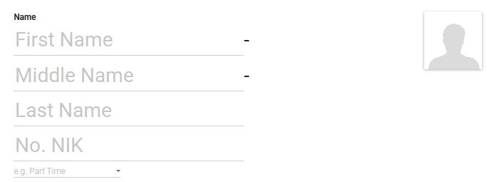

#  Alur Pembuatan Employee

Halaman ini menjelaskan langkah-langkah standar pendataan untuk mengelola dan mengatur aset-aset statis *Asset GA*.

## 1. Membuat Data Karyawan

1. Masuk ke modul **Employee**.
2. Klik tombol **Create** di pojok kiri atas halaman.
3. Masukkan nama karyawan baru pada kolom **Name** (First Name, Middle Name, Last Name).
4. Masukkan nomor nik karyawan pada kolom **No. NIK**.
5. Upload *Foto* karyawan jika ada.

<em>Gambar 1 : Tampilan pengisian form pada Data Karyawan.</em>

---

## 2. Pengisian Informasi Karyawan

Pada tab **Work Information**  masukkan informasi tempat kerja karyawan :

1. Masukkan informasi kontak karyawan dari mulai *Alamat Kerja*, *Alamat Email*, dan *Nomor Telephone*.
2. Masukkan informasi posisi karyawan di perusahaan dari mulai *Department*, *Area/Region*, *List Kota/Kab*, *Atasan*, dan *Manager*.
3. Masukkan level komisi untuk pemberian komisi penjualan pada kolom **Level Komisi**.
4. Masukkan jam kerja karyawan pada kolom **Working Hours**.

<em>Gambar 2 : Tampilan pengisian informasi tempat kerja karyawan pada tab Work Information.</em>

---

## 3. Pengisian Data Pribadi Karyawan

Pada tab **Private Information**  masukkan informasi data pribadi karyawan :

1. Masukkan informasi kontak karyawan dari mulai *Alamat Rumah*, *Alamat Email Pribadi*, dan *Kontak Darurat*.
2. Masukkan informasi status karyawan dari mulai *Agama*, *Jenis Kelamin*, dan *Status Pernikahan*.
3. Masukkan informasi kelahiran karyawan dari mulai *Tanggal Lahir* dan *Tempat Lahir*.

<em>Gambar 3 : Tampilan pengisian data pribadi karyawan pada tab Private Information.</em>

---

## 4. Pengisian Informasi Kode Karyawan

Pada tab **Bank-Tax** merupakan informasi mengenai kode dan sistem secara otomatis akan menarik *Kode Department*, *NIK Atasan*, *Kode Jabatan*, dan *Kode Lokasi*.

<em>Gambar 4 : Tampilan pengisian kode karyawan tab Bank-Tax.</em>

---

## 5. Pengisian Informasi Produk

Pada tab **Product Spesialis**  masukkan informasi mengenai daftar product yang dijual oleh sales :

1. Klik **Add a line**.
2. Pilih produk dari daftar *dropdown* pada kolom **Product**.
3. Pilih tipe pelanggan dari daftar *dropdown* pada kolom **Type Customer**.
4. Pilih department dari daftar *dropdown* pada kolom **Region**.
5. Masukkan presentase komisi yang akan didapatkan untuk penjualan produk pada kolom **%**.

<em>Gambar 5 : Tampilan pengisian produk tab Product Spesialis.</em>

---

## 6. Pengisian Informasi Pengaturan HR

Pada tab **HR Settings**  masukkan informasi mengenai perbaikan asset :

1. Pilih nama atasan dari daftar *dropdown* pada kolom **Timesheet Responsible**.
2. Pilih nama pengguna yang sudah didaftarkan ke Team ITDS dari daftar *dropdown* pada kolom **Related User**.
3. Ceklis jika menerima pendapatan pada kolom **Is Gross**.

<em>Gambar 6 : Tampilan pengisian pengaturan hr pada tab HR Settings.</em>

---

## 7. Pengisian Pengaturan Aktivity/Advance

Pada tab **Activity/Advance Setting**  merupakan pengaturan untuk atasan yang bisa menyetujui *Activity / Advance* yang sudah dibuat oleh bawahannya. Jika karyawan tersebut bukan atasan maka lewati langkah ini. 

1. Ceklis pada kolom **Approved**.
2. Kemudian klik **Save**

<em>Gambar 6 : Tampilan pengaturan Activity/Advance pada tab Activity/Advance Setting.</em>

---

## 📝 Referensi Tambahan

### SOP Harian (Checklist)
* <input type="checkbox"> **Memastikan Asset yang masukkan** sudah sesuai dan benar.
* <input type="checkbox"> **Memastikan tipe dan harga yang dimasukkan** sudah sesuai dan benar.
* <input type="checkbox"> **Memastikan lokasi dan nama pengguna asset** sudah sesuai dan benar.

### Fitur Berdasarkan Hak Akses
=== "User"
    - Dapat melihat data seluruh asset pada modul.
    - Tidak dapat membuat asset baru. 

=== "Admin"
    - Dapat membuat *Asset GA* baru dan dapat melihat keseluruhan data Asset pada modul.
    - Dapat melakukan action *Confirm* untuk mengkonfirmasi bahwa data tersebut sudah sesuai.