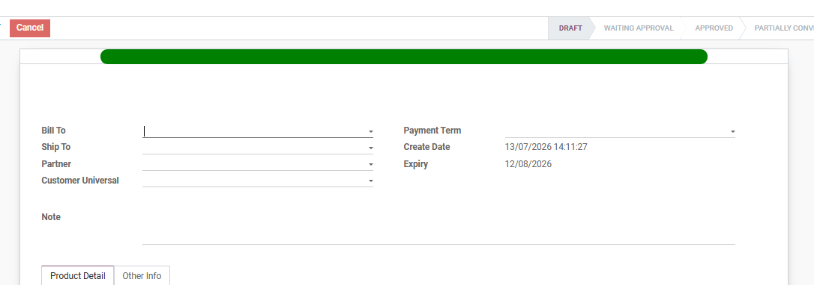
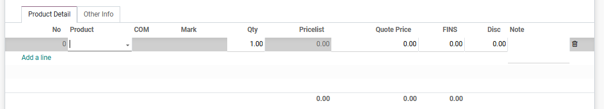
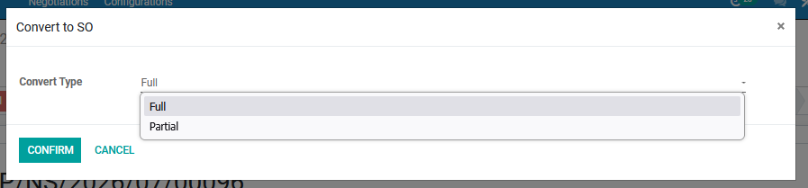

#  Alur Pembuatan Purchase Request

Halaman ini menjelaskan langkah-langkah standar untuk membuat dokumen *PR* (Permintaan Pembelian Barang) hingga menjadi *Purchase* yang siap diproses oleh tim purchase.

## 1. Membuat Permintaan Pembelian Produk Baru

1. Masuk ke modul **Purchase Requests**.
2. Klik tombol **Create** di pojok kiri atas halaman.
3. Isi data yang mengajukan permintaan pada kolom **Requested by**, dan yang akan menyetujui permintaan pada kolom **Approver**.
4. Pilih tipe pengambilan barang dari gudang mana pada kolom **Picking Type**.
5. Isi sumber dokumen **Source Document** dan alasan permintaan pengadaan produk **Description**.
6. Pilih sumber pengajuan pembelian produk dari nomor so berapa pada kolom **Procurement Group** jika ada.

<em>Gambar 1 : Tampilan pengisian form pada Negotiation Sheet.</em>

---

## 2. Pengisian Produk

Pada tab **Products**, masukkan produk yang akan diajukan pembeliannya:

1. Klik **Add a line**.
2. Pilih **Product** dari daftar *dropdown*, sistem akan otomatis menarik **Description** produk.
3. Masukkan jumlah produk yang akan diajukan pada kolom **Quantity** dan pilih satuan yang diajukan.
4. Pilih departemen pada kolom **Analytic Account** dan isi tanggal pengajuan pembelian pada kolom **Request Date**.
5. Masukkan perkiraan harga pembelian produk jika ada pada kolom **Estimated Cost**.
6. Masukkan spesifikasi produk secara detail pada kolom **Specifications**.
7. Sistem akan otomatis mengisi *Tracking* mengenai pelacakan produk yang diajukan sudah sampai tahap apa.
8. Sistem juga akan otomatis menarik data pada tab *Purchase Order Lines* mengenai pelajakan produk PO tersebut
6. Klik **Save & Close** jika produk yang diajukan hanya 1, apabila lebih dari 1 maka klik **Save & New** dan isi produk selanjutnya.
7. Kemudian klik **Save**.
8. Klik tombol **Request Approval** jika sudah tidak ada revisi pengajuan pembelian produk lagi, apabila sudah diklik maka sudah tidak bisa diedit lagi.

<em>Gambar 2 : Tampilan pengisian produk pada tab Product Detail.</em>

---

## 3. Menunggu Approval

Pada state **To Be Approved**, ada beberapa kondisi berdasarkan warna pada Negotiation Sheet yang dibuat :

1. Warna "Hijau" berarti tidak perlu meminta Approval, bisa dilewati pada langkah ini.
2. Lakukan pemeriksaan berkala pada PR yang diajukan. Jika pihak terkait (MKT/PE) sudah melakukan approved, maka akan terdapat informasi PO untuk PR yang dibuat.
3. Kemudian jika vendor sudah melakukan pengiriman maka akan tampil data terkait pengiriman yaitu stock moves artinya perpindahan stok dari gudang vendor ke gudang perusahaan.
4. Kemudian odoo akan menampilkan informasi terkait penerimaan barang dan penambahan stok barang pada gudang.
5. Pihak yang melakukan penginputan selanjutnya dapat melakukan proses selanjutnya karena produk yang dibutuhkan sudah tersedia di gudang Center.

---

## 5. Melakukan Konfirmasi menjadi Converted 

Setelah dokumen penawaran disetujui oleh pelanggan, Anda harus mengubah statusnya menjadi *Converted* agar modul *Sales* dapat mendeteksi adanya penjualan barang.

* Klik tombol **Convert To So** yang berada di barisan tombol aksi kiri atas.
* Pilih tipe convert **Full** atau **Partial**
* Status dokumen di pojok kanan atas akan otomatis berubah dari **Approved** menjadi **Converted** atau **Partially Converted**.

<em>Gambar 4 : Tampilan confirm Convert To SO.</em>

<!-- !!! warning "Peringatan Penting Sebelum Konfirmasi"
    Pastikan Anda telah memeriksa ulang nilai pada Tabel **Calculation** dan **Warna** yang tertera. Dokumen yang sudah berstatus *Converted* maka sudah bisa lanjut pada modul **Sales**. -->

## 📝 Referensi Tambahan

### SOP Harian (Checklist)
* <input type="checkbox"> **Pastikan Nama Customer (Bill To - Ship To - Partner - Customer Universal)** sudah sesuai dan benar.
* <input type="checkbox"> **Memastikan Produk dan Quantity serta Diskon atau potongan harga dan ongkir** sudah sesuai dengan kebutuhan customer/pembeli.
* <input type="checkbox"> **Pastikan Bagian COS (Cost of Sales)** sudah sesuai dengan kesepakatan.

### Fitur Berdasarkan Hak Akses
=== "Admin SAS"
    - Dapat membuat *NS* baru dan dapat melihat keseluruhan data pada modul.
    - Dapat melakukan action *Submit* jika penawaran sudah sesuai 
    - Dapat melakukan action *Convert to SO* jika sesuai selesai tahap Approval

=== "DIR"
    Memiliki tombol untuk menyetujui diskon di luar batas standar dan mengubah *APPROVE* khusus (*Merah atau Oranye*).
    Memiliki tampilan Tab perhitungan (Dir View)

=== "GSM"
    Memiliki tombol untuk menyetujui diskon di luar batas standar *APPROVE* khusus (*Kuning*).

=== "RSM"
    Memiliki tombol untuk menyetujui diskon di luar batas standar *APPROVE* khusus (*Biru*).

=== "ASM"
     Hanya dapat melihat data user dan area masing-masing.

??? info "What Next?"
    Setelah *NS* sudah dilakukan *Convert to SO* selanjutnya dokumen akan masuk ke Modul *Sales*.
    [Lanjut ke Modul Sales:octicons-arrow-right-16:](../dept_sales/sales_quotation.md)