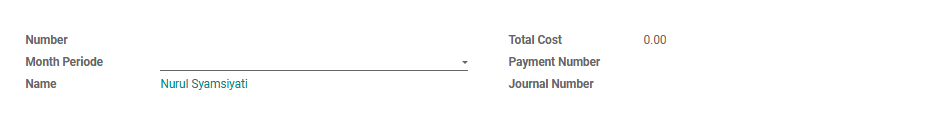
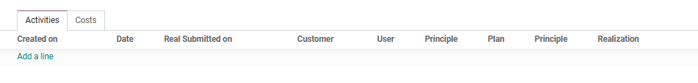

#  Alur Pembuatan Activity

Halaman ini menjelaskan langkah-langkah standar untuk membuat dokumen *Aktivitas* (Penawaran Harga) hingga menjadi *Sales Order* (SO) yang siap diproses oleh tim gudang.

## 1. Membuat Aktivitas Baru

1. Masuk ke modul **Activity** > **Waiting Approval** > **Post Journal**
2. Klik tombol **Create** di pojok kiri atas halaman.
3. Isi bulan yang berjalan pada kolom **Month Periode**
4. Sistem akan otomatis menarik nama pembuat sesuai akun yang digunakan pada kolom **Name**.

*Gambar 1 : Tampilan pengisian form activity.*

---

## 2. Pengisian Rencana Aktivitas 

Pada tab **Activities**, masukkan kegiatan pekerjaan yang dilakukan selama periode bulan yang berjalan.

1. Klik **Add a line**.
2. Pilih tanggal pada kolom **Date**.
3. Jika ingin melakukan kunjungan ke tempat lain maka isi nama outlet yang akan dikunjungi pada kolom **Customer** dan nama orang yang dikunjungi pada kolom **User**. Lalu pilih product yang ditawarkan kepada pelanggan pada kolom **Principle**.
4. Kemudian isi rencana yang akan dilakukan pada tanggal itu.
5. Setelah itu klik tombol **Submit**.

*Gambar 2 : Tampilan pengisian activity.*

---

## 3. Pengisian Realisasi Aktivitas 

Pada tab **Activities**, setelah membuat rencana aktivitas/kunjungan maka harus mengisi realisasi sesuai yang dilakukan pada periode bulan yang berjalan.

1. Pilih line sesuai tanggal kegiatan yang akan diisi realisasi nya **Add a line**.
2. Pilih tanggal pada kolom **Date**.
3. Jika ingin melakukan kunjungan ke tempat lain maka isi nama outlet yang akan dikunjungi pada kolom **Customer** dan nama orang yang dikunjungi pada kolom **User**. Lalu pilih product yang ditawarkan kepada pelanggan pada kolom **Principle**.
4. Kemudian isi rencana yang akan dilakukan pada tanggal itu.

*Gambar 2 : Tampilan pengisian activity.*

