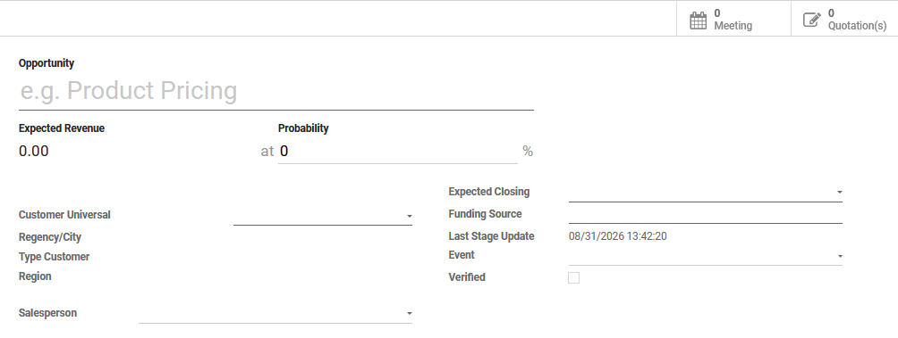
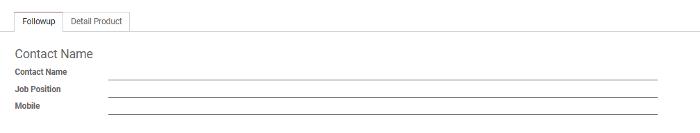
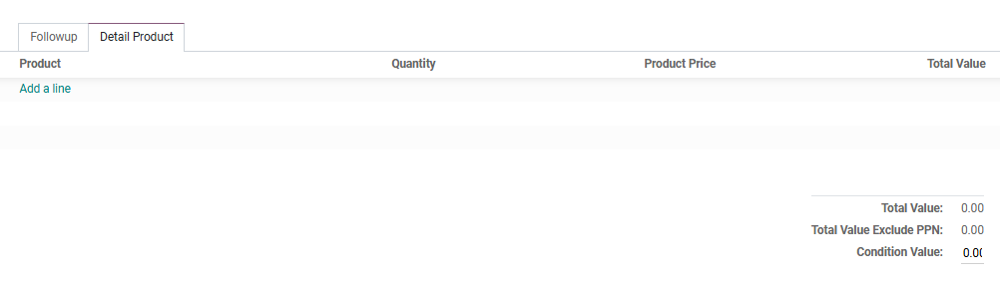
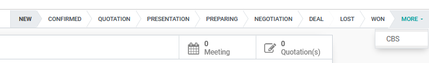
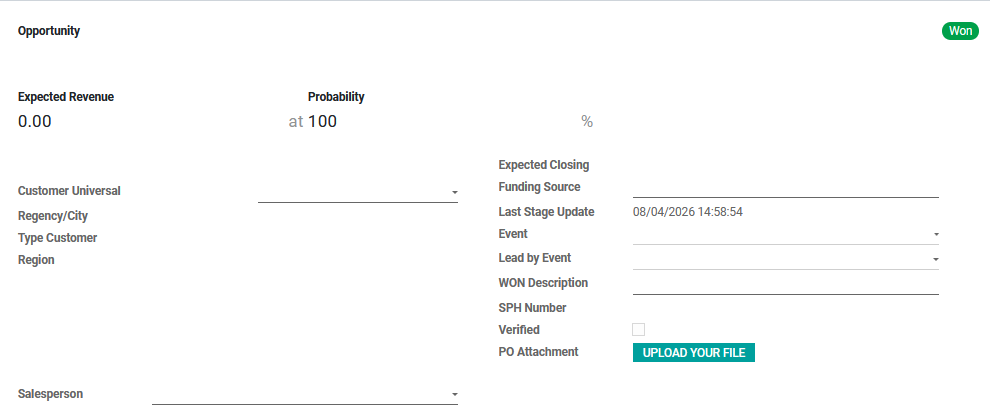

#  Alur Pembuatan CRM

Halaman ini menjelaskan langkah-langkah standar untuk membuat dokumen *CRM* dimana untuk melihat potensi perencanaan penjualan dan laporan hasil kunjungan pada area masing-masing sales.

## 1. Membuat CRM Baru

1. Masuk ke modul **CRM** > **Stage**.
2. Klik tombol **Create** di pojok kiri atas halaman.
3. Isi nama product yang ditawarkan pada kolom **Opportunity**.
4. Isi nama pelanggan yang ditawarkan product tersebut pada kolom **Customer Universal**, jika pelangan belum terdaftar di list maka daftarkan terlebih dahulu ke Team EDP. Sistem secara otomatis akan menarik *Regency/City*, *Type Customer*, dan *Region*.
5. Pilih nama sales yang menawarkan ke outlet tersebut pada kolom **Salesperson**.
6. Tentukan perkiraan kemungkinan keberhasilan prospek nya pada kolom **Probability** dan isi tanggal berakhirnya prospek tersebut pada kolom **Expected Closing**.
7. Isi sumber data tersebut berasal dari mana pada kolom **Funding Source**.
8. Jika prospek tersebut berasal dari event maka pilih nama event tersebut pada kolom **Lead by Event**.
9. Ceklis pada kolom **Verified** setelah melakukan verifikasi dokumen yang diminta dan isi nya sudah sesuai dengan target yang di maksud.

<em>Gambar 1 : Tampilan pengisian form pada CRM.</em>

---

## 2. Pengisian Nama Pelanggan

Pada tab **Followup** di bagian **SAS**, masukkan informasi pelanggan:

1. Masukkan nama pelanggan pada kolom **Contact Name**.
2. Isi jabatan pelanggan tersebut pada kolom *Job Position*.
3. Masukkan juga nomor telephon pada kolom **Mobile**.

<em>Gambar 2 : Tampilan pengisian nama pelanggan pada tab Followup.</em>

---

## 3. Pengisian Produk

Pada tab **Detail Product** di bagian **SAS**, masukkan produk yang ingin ditawarkan kepada pelanggan:

1. Klik **Add a line**.
2. Pilih produk dari daftar *dropdown*.
3. Masukkan jumlah produk pada kolom **Qty**.
4. Sistem akan otomatis menarik **Program**, **Faskes**, dan **Harga Produk**. Jika ada kesepakan lain untuk harga bisa dirubah pada kolom **Product Price** sesuai kesepakatan.
5. Kemudian klik **Save**

<em>Gambar 3 : Tampilan pengisian produk pada tab Detail Product.</em>

---

## 4. Merubah Progres

Pada state yang bukan **New** merupakan progres untuk crm tersebut, yaitu :

1. **Confirmed** : Informasi adanya Kebutuhan yang sudah TERKONFIRMASI atau informasi rencana belanja tahun ini / tahun depan.
2. **Quotation** : Sudah mengirimkan SPH.
3. **Presentation** : Sudah dilakukan presentasi, demo unit, trial atau kegiatan support lainnya yang terkait (khusus) untuk proyek tersebut.
4. **Preparing** : Sudah sepakat jumlah pasti (Qty) produk – produk yang akan di pesan.
5. **Negotiation** : Sudah klik (Ekatalog) sedang proses negosiasi harga, ongkir, dan lain-lain.
6. **Deal** : Sudah sepakat Ekatalog sedang proses / menunggu PO / SP / Kontrak.
7. **Lost** : Gagal
8. **Won** : Sudah menerima PO / SP/ Kontrak.
9. **CBS** : Batal otomatis pada Sistem karena sudah melebihi batas tanggal yang sudah ditentukan pada kolom *Expected Closing*.

<em>Gambar 4 : Tampilan stage pada crm.</em>

---

## 5. Pengisian jika statusnya **WON**

Pada state **WON** merupakan keberhasilan untuk penawaran penjualan yang sudah ada kontrak nya.

1. Isi penjelasan untuk penjualan yang sudah sepakat pada kolom **WON Description**.
2. Lampirkan file PO kesepakatan tersebut pada kolom **PO Attachment**.
3. Kemudian klik **Save**.

<em>Gambar 5 : Tampilan pengisian crm yang status nya won.</em>

## 📝 Referensi Tambahan

### SOP Harian (Checklist)
* <input type="checkbox"> **Pastikan Nama Customer (Customer Universal atau Contact Name)** sudah sesuai dan benar.
* <input type="checkbox"> **Memastikan Produk dan Quantity serta Diskon** sudah sesuai dengan penawaran yang diberikan kepada customer/pembeli.
* <input type="checkbox"> **Pastikan besarnya perkiraan keberhasilan penawaran** sudah sesuai dengan kesepakatan.

### Fitur Berdasarkan Hak Akses
=== "SAS"
    - Dapat membuat *CRM* baru dan dapat melihat keseluruhan data pada modul.
    - Dapat melakukan action untuk memindahkan progress *Stage* sesuai kondisi perencanaan penjualan yang terjadi.

=== "DS"
    - Dapat membuat *CRM* baru dan hanya dapat melihat data masing-masing user pada modul.
    - Dapat melakukan action untuk memindahkan progress *Stage* sesuai kondisi perencanaan penjualan yang terjadi.

=== "ASM"
    - Dapat membuat *CRM* baru dan dapat melihat keseluruhan data area yang dibawahi pada modul.
    - Dapat melakukan action untuk memindahkan progress *Stage* sesuai kondisi perencanaan penjualan yang terjadi.

=== "RSM"
    - Dapat membuat *CRM* baru dan dapat melihat keseluruhan data per region yang dibawahi pada modul.
    - Dapat melakukan action untuk memindahkan progress *Stage* sesuai kondisi perencanaan penjualan yang terjadi.

=== "GSM"
    - Dapat membuat *CRM* baru dan dapat melihat keseluruhan data pada modul.
    - Dapat melakukan action untuk memindahkan progress *Stage* sesuai kondisi perencanaan penjualan yang terjadi.

=== "MKT"
    - Hanya dapat melihat seluruh perencanaan penjualan product yang sudah dibuat oleh sales.

=== "ITDS"
    - Dapat melakukan action untuk memindahkan progress *Stage* **WON** menjadi *Stage* yang dibutuhkan sesuai kondisi perencanaan penjualan yang terjadi.

??? info "What Next?"
    Setelah *CRM* sudah dilakukan *Quotation* selanjutnya dokumen akan masuk ke Modul *Negotiation Sheet*.
    [Lanjut ke Modul NS:octicons-arrow-right-16:](../dept_sales/negotiation_sheet.md)
