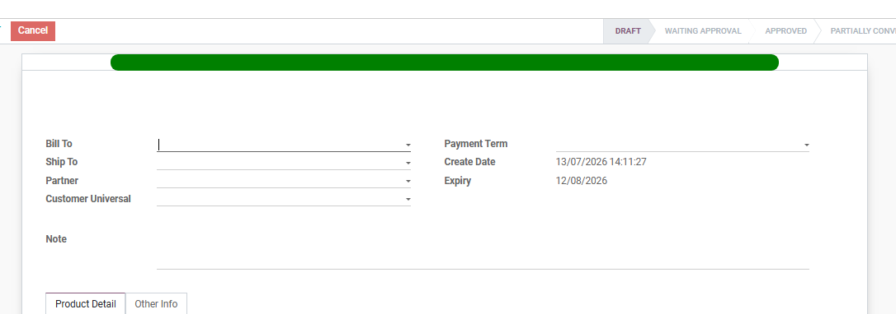
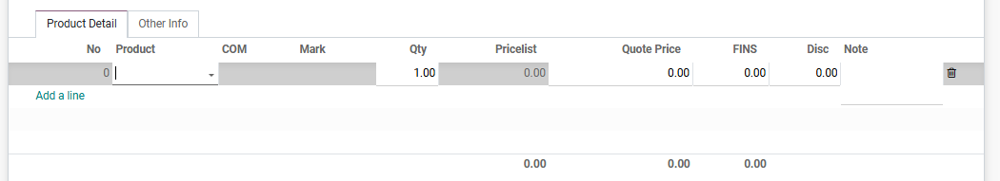

#  Alur Pembuatan CRM

Halaman ini menjelaskan langkah-langkah standar untuk membuat dokumen *Quotation* (Penawaran Harga) hingga menjadi *Sales Order* (SO) yang siap diproses oleh tim gudang.

## 1. Membuat CRM Baru

1. Masuk ke modul **CRM** > **Stage**.
2. Klik tombol **Create** di pojok kiri atas halaman.
3. Isi nama product yang ditawarkan pada kolom **Opportunity**.
4. Isi nama pelanggan yang ditawarkan product tersebut pada kolom **Customer Universal**, jika pelangan belum terdaftar di list maka daftarkan terlebih dahulu ke Team EDP. Sistem secara otomatis akan menarik *Regency/City*, *Type Customer*, dan *Region*.
5. Pilih nama sales yang menawarkan ke outlet tersebut pada kolom **Salesperson**.
6. Tentukan termin pembayaran penawaran pada kolom **Payment Term**.
7. Isi **Note** jika diperlukan.

<em>Gambar 1 : Tampilan pengisian form pada Negotiation Sheet.</em>

---

## 2. Pengisian Produk dan Harga

Pada tab **Product Detail**, masukkan produk yang ingin ditawarkan kepada pelanggan:

1. Klik **Add a line**.
2. Pilih produk dari daftar *dropdown*.
3. Masukkan jumlah produk pada kolom **Qty**.
4. Sistem akan otomatis menarik harga standar, ongkos kirim, dan diskon. Anda dapat mengubah harga satuan secara manual pada kolom **Quote Price**, mengubah ongkos kirim pada kolom **FINS**, dan mengubah diskon pada kolom **Disc** jika terdapat kesepakatan khusus.
5. Isi **Note** jika diperlukan.

<em>Gambar 2 : Tampilan pengisian produk pada tab Product Detail.</em>
