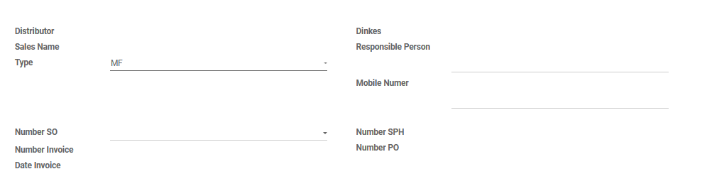
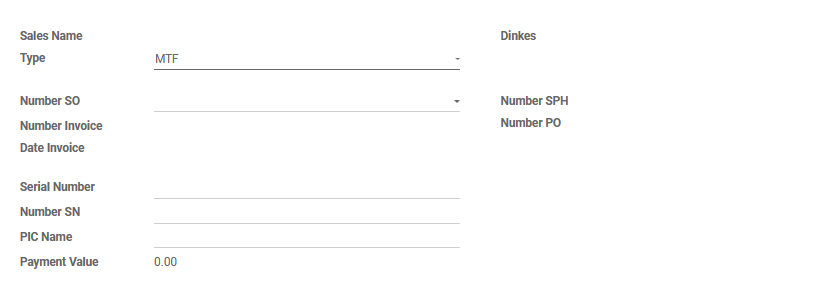
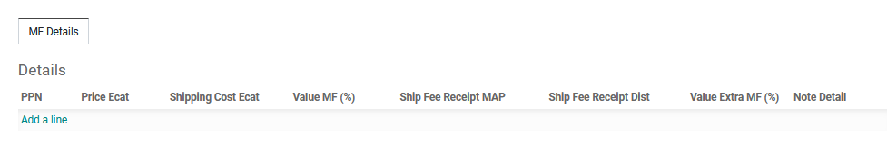
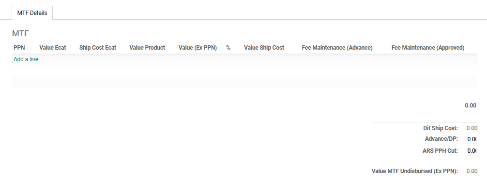

#  Alur Pembuatan Request Payment (Request MF/MTF)

Halaman ini menjelaskan langkah-langkah standar untuk membuat dokumen *Request* (Permintaan Pembayaran MF/MTF) yang siap diproses oleh tim FA.

## 1. Membuat Request Baru

1. Masuk ke modul **Request Payment** > **Request MF / MTF** > **Review** > **Approval** > **MF/MTF**.
2. Klik tombol **Create** di pojok kiri atas halaman.
3. Pilih tipe permintaan pembayaran pada kolom **Type**.
3. Masukkan nomor SO pada kolom **Number SO**.
4. Sistem akan otomatis menarik nama Distributor, Dinkes, Number SPH/Invoice/PO, dan Date Invoice.
5. Jika tipe yang dipilih adalah *MF* maka isi penanggung jawab pada kolom **Responsible Person** dan nomor telephone  pada kolom **Mobile Numer**.
6. Jika tipe yang dipilih adalah *MTF* maka isi nomor rek penerima pada kolom **Serial Number**, isi kode bank pada kolom **Number SN** dan isi nama penerima pada kolom **PIC Name**

*Gambar 1.1 : Tampilan pengisian form MF.*

*Gambar 1.2 : Tampilan pengisian form MTF.*

---

## 2. Pengisian Harga dan Ongkos Kirim (untuk tipe **MF**)

Pada tab **MF Details**, masukkan produk yang telah dijual :

1. Klik **Add a line**.
2. Pilih PPN nya.
3. Masukkan Harga dan ongkos kirim ecat pada kolom **Price Ecat** dan **Shipping Cost Ecat**.
4. Masukkan presentase nilai MF dan ekstra MF pada kolom **Value MF (%)** dan **Value Extra MF(%)**.
5. Sistem akan otomatis menghitung *MF*, *Shipping Cost*, dan *Extra MF*
6. Apabila nilai nya sudah sesuai maka klik **Save**

*Gambar 2 : Tampilan pengisian product pada Sales Order.*

---

## 3. Pengisian Harga dan Ongkos Kirim (untuk tipe **MTF**)

Pada tab **MTF Details**, masukkan produk yang ingin ditawarkan kepada pelanggan:

1. Klik **Add a line**.
2. Pilih PPN nya.
3. Masukkan Harga dan ongkos kirim ecat pada kolom **Value Ecat** dan **Ship Cost Ecat**.
4. Masukkan presentase nilai MTF dan nilai ongkos kirim yang sesuangguhnya pada kolom **%** dan **Value Ship Cost**.
5. Sistem akan otomatis menghitung *Value Product*, *Value (Ex PPN)*, dan *Fee Maintenance*
6. Jika ada pengajuan untuk pembayaran maka masukkan nilai pada kolom **Advance/DP**
7. Jika ada potongan biaya ARS PPH maka masukkan nilai pada kolom **ARS PPH Cut**
8. Apabila nilai nya sudah sesuai maka klik **Save**

*Gambar 2 : Tampilan pengisian product pada Sales Order.*

---

## 4. Menunggu Review 1 dan Approval GSM 

Pada state **Review 1** dan **Approve GSM**
Review 1 yaitu *SPV SAS* dengan mengecek kebenaran data nya dan jika sudah sesuai maka akan di Approve oleh  *GSM*

---

## 5. Menunggu Review 2 dan Approval FAM 

Pada state **Review 2** dan **Approve FAM**, ada beberapa kondisi ketika masuk ke state ini:

1. Credit Limit yang bermasalah karena sudah melebihi batas dari **Credit Limit** yang sudah ditentukan.
2. Kabupaten / Kota yang perlu di waspadai berdasarkan **Kota/Kab** pelanggan
3. Jika kondisi **Credit limit** dan **Kota/Kab** tidak bermasalah maka bisa lewati langkah ini.
4. Pengajuan pembukaan **Credit Limit** melalui Form yang sudah disetujui oleh FA dan DIR, dan akan di proses oleh ITDS untuk Approve.
