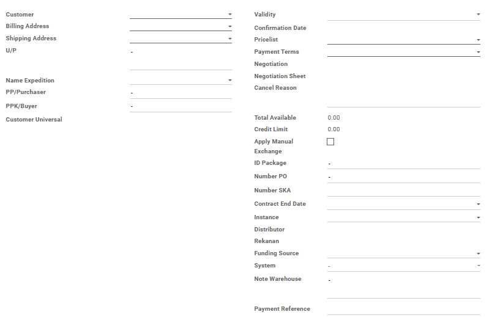
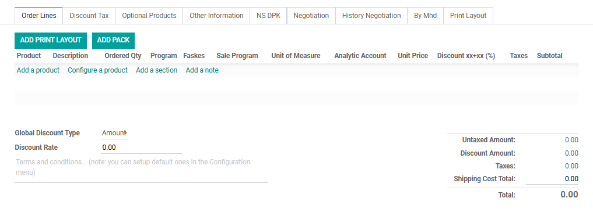
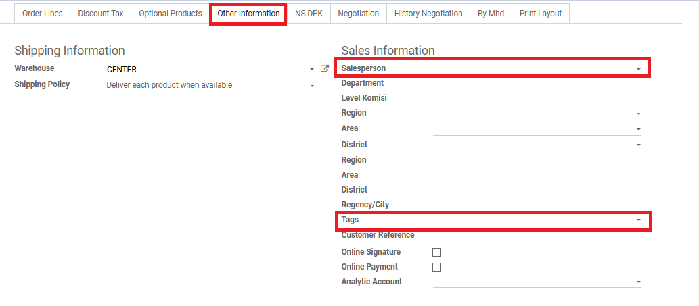

#  Alur Pembuatan Sales Order (Quotation)

Halaman ini menjelaskan langkah-langkah standar untuk membuat dokumen *Quotation* (Penawaran Harga) hingga menjadi *Sales Order* (SO) yang siap diproses oleh tim gudang.

## 1. Membuat Quotation Baru

1. Masuk ke modul **Sales** > **Orders** > **Quotations** > **Waiting Approve Credit** > **Locked**.
2. Klik tombol **Create** di pojok kiri atas halaman.
3. Isi data pelanggan pada kolom **Customer**, **Billing Address**, dan **Shipping Address**. Jika pelanggan belum terdaftar, Anda bisa mengajukan Form New Customer ke Team EDP.
4. Tentukan termin pembayaran penawaran pada kolom **Payment Terms**.

*Gambar 1 : Tampilan pengisian form pada Sales Order.*

---

## 2. Pengisian Produk dan Harga

Pada tab **Order Lines**, masukkan produk yang ingin ditawarkan kepada pelanggan:

1. Klik **Add a product**.
2. Pilih produk dari daftar *dropdown*.
3. Masukkan jumlah produk pada kolom **Ordered Qty**.
4. Sistem akan otomatis menarik harga standar. Anda dapat mengubah harga satuan secara manual pada kolom **Unit Price** dan mengubah diskon pada kolom **Discount xx+xx(%)** jika terdapat kesepakatan khusus.

*Gambar 1 : Tampilan pengisian product pada Sales Order.*

<!-- !!! note "Tips Pengisian Cepat"
    Anda bisa menekan tombol `Tab` pada *keyboard* untuk berpindah antar-kolom di Order Lines dengan lebih cepat tanpa perlu klik *mouse*. -->

---

## 3. Pengisian Informasi

Pada tab **Other Information**, masukkan informasi sales yang menangani penawaran tersebut:

1. Pilih nama sales yang menanangi penjualan tersebut pada kolom **Salesperson**.
2. Sistem akan otomatis menarik Department, Level Komisi, Region, Area, District, dan Regency/City
3. Pilih tags departement nya pada kolom **Tags**.
4. Lalu klik **Save** dan *state* akan berada di **Quotation** dan masih bisa di edit.

*Gambar 1 : Tampilan pengisian informasi pada Negotiation Sheet.*

---

## 4. Menunggu Approval

Pada state **Waiting Approve Credit**, ada beberapa kondisi ketika masuk ke state ini:

1. Credit Limit yang bermasalah karena sudah melebihi batas dari **Credit Limit** yang sudah ditentukan.
2. Kabupaten / Kota yang perlu di waspadai berdasarkan **Kota/Kab** pelanggan
3. Jika kondisi **Credit limit** dan **Kota/Kab** tidak bermasalah maka bisa lewati langkah ini.
4. Pengajuan pembukaan **Credit Limit** melalui Form yang sudah disetujui oleh FA dan DIR, dan akan di proses oleh ITDS untuk Approve.

---

## 5. Melakukan Konfirmasi menjadi Sales Order (SO)

Setelah dokumen penawaran disetujui oleh pelanggan, Anda harus mengubah statusnya menjadi *Locked* agar modul *Inventory* dapat mendeteksi adanya kebutuhan pengiriman barang.

* Klik tombol **Confirm** yang berada di barisan tombol aksi kiri atas.
* Status dokumen di pojok kanan atas akan otomatis berubah dari **Quotation** menjadi **Locked**. Apabila sudah di invoice kan maka status berubah dari **Locked** menjadi **Sales Order**

!!! warning "Peringatan Penting Sebelum Konfirmasi"
    Pastikan Anda telah memeriksa ulang **Taxes** (Pajak) dan **Pricelist** yang digunakan. Dokumen yang sudah berstatus *Sales Order* dan melahirkan dokumen pengiriman gudang akan memerlukan *effort* lebih (seperti melakukan *cancel* atau membuat *credit note*) jika ingin diubah kembali.