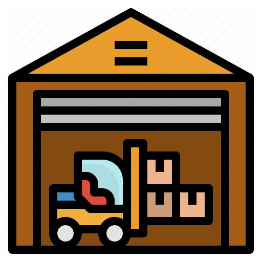

#  alar Pembuatan Inventory

Halaman ini menjelaskan langkah-langkah standar untuk membuat dan mengelola *Inventory* (Produk).

## 1. Membuat Produk Baru

1. Masuk ke modul **Inventory** > **Master Data** > **Products**.
2. Klik tombol **Create** di pojok kiri atas halaman.
3. Isi nama produk pada kolom **Product Name**.
4. Ceklis berdasarkan kriteria produk, apakah produk tersebut merupakan produk jual (*Can be Sold*)/ produk beli (*Can be Purchased*) / biaya produk (*Is a Landed Cost*) / produk operasional (*Can be Expensed*).
5. Masukkan foto produk jika ada pada kolom **Image** di sebelah kanan.

<em>Gambar 1 : Tampilan pengisian form pada Produk.</em>

---

## 2. Memasukkan Informasi Produk

Pada tab **General Information**, masukkan semua informasi mengenai produk tersebut :

1. Pilih tipe produk dari daftar *dropdown* pada kolom **Product Type**. apakah produk tersebut merupakan produk fisik yang disimpan yang bisa terlihat keluar masuk produk tersebut (*Storable Product*) / product service (*Service*) / produk habis pakai (*Consumable*).
2. Pilih kategori produk pada kolom **Product Category**. Jika kategori belum terdaftar, Anda bisa membuatnya langsung dari kolom ini.
3. Masukkan informasi produk dari mulai kode product *Internal Reference*, *Barcode*, *AKL*, *Info AKL*, dan *HS Code*.
4. Pilih kode vendor produk pada kolom **Principal**. Jika kategori belum terdaftar, Anda bisa membuatnya langsung dari kolom ini.
5. Masukkan tanggal penerimaan form pengajuan produk tersebut pada kolom **Received Date**.
6. Masukkan kriteria produk tersebut pada kolom **Program**.
7. Masukkan satuan / pack produk tersebut pada **Unit of Measure**, **Physical unit**, dan **Purchase Unit of Measure**.
8. Isi catatan yang diperlukan mengenai produk tersebut pada kolom **Internal Notes**.

<em>Gambar 1 : Tampilan pengisian informasi pada Produk.</em>

!!! note "Tips Pengisian Cepat"
    Anda bisa menekan tombol `Tab` pada *keyboard* untuk berpindah antar-kolom di Order Lines dengan lebih cepat tanpa perlu klik *mouse*.

---

## 3. Memasukkan Informasi Variasi Produk

Pada tab **Variants**, masukkan semua informasi mengenai variasi pada produk tersebut, jika tidak ada makan bisa lewati langkah ini.

1. Klik **Add a line**.
2. Pilih kelengkapan produk pada kolom **Attribute**. Jika kelengkapan belum terdaftar, Anda bisa membuatnya langsung dari kolom ini.
3. Masukkan nilai kelengkapan produk pada kolom **Attribute Values**. Jika nilai belum terdaftar, Anda bisa membuatnya langsung dari kolom ini.
8. Isi catatan yang diperlukan mengenai produk tersebut pada kolom **Internal Notes**.

<em>Gambar 1 : Tampilan pengisian variasi pada Produk.</em>

---

## 4. Memasukkan Informasi Peringatan Produk

Pada tab **Service**, masukkan peringatan pada produk tersebut yang akan muncul pada modul service, jika tidak ada maka bisa lewati langkah ini.

1. Ceklis jika akan memunculkan peringatan **Warning**.
2. Isi peringatan produk yang akan muncul pada kolom **Note Warning**.

<em>Gambar 1 : Tampilan pengisian notifikasi produk pada modul service.</em>

---

## 5. Memasukkan Informasi Penjualan Produk

Pada tab **Sales**, masukkan semua informasi untuk penjualan pada produk tersebut yang akan muncul pada modul sales, jika bukan merupakan produk jual bisa lewati langkah ini.

1. Klik **Add a line**.
2. Isi pricelist produk. Pilih **Pricelist**, isi harga produk **Price**, masukkan tanggal mulai berlakunya harga produk **Start Date** dan tanggal berakhirnya harga produk **End Date**, dan isi presentase ICR berdasarkan data yang diajukan **ICR (%)**.
3. Pilih kebijakan penagihan berdasarkan orderan *Ordered quantities* atau berdasarkan pengiriman *Delivered quantities*. Dan pilih bagaimana penagihan ulang dilakukan **Re-Invoice Policy**.
4. Ceklist **Is an Event Ticket** jika produk tersebut merupakan produk even.
5. Pilih opsi produk yang sama pada kolom **Optional Products**, jika tidak ada tidak perlu di isi.
6. Isi deskripsi untuk produk **Description for Customers** dan pilihan warning **Warning when Selling this Product** apabila catatan tersebut diperlukan untuk notif ketika ada nya SO pada produk tersebut.

<em>Gambar 1 : Tampilan pengisian harga jual pada Produk.</em>

---

## 6. Memasukkan Informasi Pembelian Produk

Pada tab **Purchase**, masukkan semua informasi untuk pembelian pada produk tersebut yang akan muncul pada modul purchase, jika bukan merupakan produk beli bisa lewati langkah ini.

1. Klik **Add a line**.
2. Isi informasi pembelian produk. Pilih **Vendor** pembelian produk, isi minimal pembelian produk **Minimal Quantity** dan satuan produk **Unit of Measure**, isi harga produk **Price** dan **Currency**, dan masukkan tanggal mulai **Start Date** dan tanggal berakhirnya **End Date** harga produk. Jika ada produk varian maka isi pada kolom **Product Variant**.
3. Pilih kebijakan pembayaran berdasarkan orderan produk *On ordered quantities* atau berdasarkan penerimaan produk *On received quantities*. Dan pilih pajak vendornya pada kolom **Vendor Taxes**.
4. Isi deskripsi untuk produk **Description for Vendors** dan pilihan warning **Warning when Purchasing this Product** apabila catatan tersebut diperlukan untuk notif ketika ada nya pembelian pada produk tersebut.

<em>Gambar 1 : Tampilan pengisian harga beli pada Produk.</em>

---

## 7. Memasukkan Informasi Pengiriman Produk

Pada tab **Inventory**, masukkan semua informasi untuk estimasi waktu pengiriman/penerimaan pada produk tersebut.

1. Pilih **Routes** untuk produk ini didapatkan dari membeli/produksi/order.
2. Isi estimasi pengiriman produk dari vandor hingga diterima **Manufacturing Lead Time**, dan estimasi pengemasan produk untuk dikirimkan kepada pelanggan **Customer Lead Time**.
3. Pilih **Tracking** produk apakah mempunyai lot  *By Lots* atau tidak *No Tracking*.
4. Jika tracking produk *By Lots* isi estimasi berapa lama produk digunakan pada kolom *Dates*, dan isi berat beserta ukuran produk pada kolom *Logistics*.
5. Isi bentuk ukuran paket produk nya pada kolom **Packaging** jika diperlukan.
6. Isi deskripsi untuk produk **Description for Delivery Orders** untuk tampil notif pada DO, **Description for Receipts** untuk tampil notif pada RI, dan **Description for Internal Transfers** untuk tampil notif pada ITR.

<em>Gambar 1 : Tampilan pengisian Estimasi Pengiriman/Penerimaan pada Produk.</em>

---

## 8. Memasukkan Informasi Ukuran Produk

Pada tab **Cargo Info**, masukkan informasi mengenai ukuran pada produk tersebut.
    
1. Masukkan panjang produk pada kolom **Length (cm)**.
2. Masukkan lebar produk pada kolom **Width (cm)**.
3. Masukkan tinggi produk pada kolom **Height (cm)**.
4. Masukkan berat produk pada kolom **Weight (kg)**.
5. Sistem secara otomatis akan menghitung **Kubikasi (CM3)** dan **Value** pada produk berdasarkan ukuran yang telah dimasukkan.

<em>Gambar 1 : Tampilan pengisian ukuran pada Produk.</em>

---

## 9. Memasukkan Informasi Link Produk

Pada tab **Link**, masukkan informasi link yang berhubungan pada produk tersebut yang dapat diakses.
    
1. Masukkan link brosur produk pada kolom **Link Brochure**.
2. Masukkan link AKL produk pada kolom **Link AKL**.
3. Masukkan link penggunaan produk pada kolom **Link User Manual**.
4. Masukkan link ecatalog produk pada kolom **Link Ecatalog**.
5. Masukkan link lainnya terkait produk pada kolom **Other Link**.

<em>Gambar 1 : Tampilan pengisian link pada Produk.</em>

---

## 10. Memasukkan Informasi Diskon Produk

Pada tab **Discount**, masukkan semua informasi untuk diskon maksimal yang diberikan kepada pelanggan yang akan mempengaruhi perhitungan dan warna pada SPH.

1. Klik **Add a line**.
2. Pilih **Pricelist** produk dari daftar *dropdown*.
3. Pilih **COM** komisi produk dari daftar *dropdown*.
4. Masukkan nilai diskon pada kolom **DP**, **RSM**, **GSM**, **D**, **DD**, **GSM**, dan **D** sesuai dengan nilai yang telah ditentukan management.

<em>Gambar 1 : Tampilan pengisian diskon pada Produk.</em>

---

## 11. Memasukkan Informasi Invoice Produk

Pada tab **E-Invoicing**, masukkan informasi untuk invoice produk tersebut.

1. Checklist **Is E-Invoicing Exported** jika ingin mengexport produk tersebut.
2. Pilih tanggal export invoice untuk produk tersebut pada kolom **E-Invoicing Exported Date**.

<em>Gambar 1 : Tampilan pengisian E-Invoicing pada Produk.</em>

---

## 🔄 Gambaran Umum Alur Barang

Proses pergerakan stok di Odoo dibagi menjadi dua jalur utama berdasarkan tipe dokumennya:

=== "Alur Barang Masuk (Inbound)"
    1. Tim Purchasing menerbitkan *Purchase Order* (PO).
    2. Sistem Odoo secara otomatis membuat dokumen **Receipts (WH/IN)** di modul Inventory.
    3. Tim Gudang melakukan pemeriksaan fisik, mencocokkan jumlah, lalu melakukan *Validate* untuk menambah stok.

=== "Alur Barang Keluar (Outbound)"
    1. Tim Sales mengonfirmasi *Sales Order* (SO).
    2. Sistem Odoo secara otomatis menerbitkan dokumen **Delivery Orders (WH/OUT)**.
    3. Tim Gudang melakukan *picking*, *packing*, dan memvalidasi pengiriman agar stok berkurang secara *real-time*.

---

## 📝 Protokol Wajib Tim Gudang (SOP)

Sebelum melakukan validasi dokumen pergerakan barang, pastikan langkah-langkah berikut telah terpenuhi:

-   [ ] Memeriksa fisik barang (tidak cacat/rusak).
-   [ ] Memastikan kuantitas fisik sama persis dengan kolom **Done** di Odoo.
-   [ ] Mengisi nomor seri (*Lot/Serial Number*) jika produk yang diterima wajib *tracking*.

!!! warning "Penting untuk Diperhatikan"
    Jangan pernah menekan tombol **Validate** jika jumlah barang fisik belum sesuai dengan yang tertera di sistem. Jika terjadi selisih, gunakan fitur *Backorder* yang disediakan oleh Odoo.