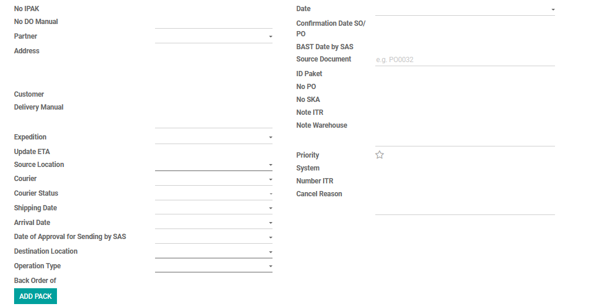
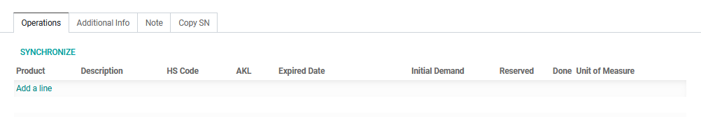
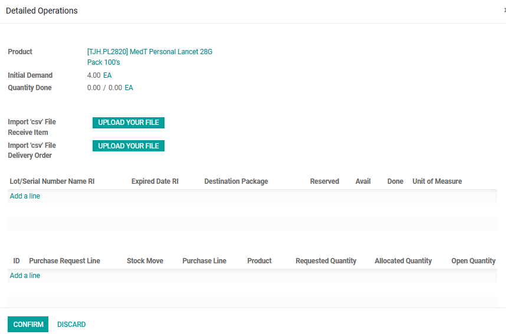
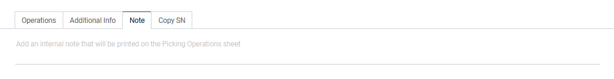

#  Alur Pembuatan Receipts

Halaman ini menjelaskan langkah-langkah standar untuk membuat dokumen *RI* (Penerimaan Barang) hingga menjadi *Invoice* yang siap diproses oleh tim FA.

## 1. Membuat RI Baru

1. Masuk ke modul **Inventory** > **Receipts**.
2. *RI* secara otomatis sudah terbuat dari *PO* yang telah terbentuk.
3. Pilih *RI* yang akan di proses. Dan klik *Edit*.
4. Lengkapi pengisian kolom yang belum terisi seperti pengisian tanggal *RI* ini diterima pada kolom **Date**, dan pengisian catatan yang sehubungan dengan pengiriman barang tersebut pada kolom **Note Warehouse**.

<em>Gambar 1 : Tampilan pengisian informasi penerimaan produk.</em>

---

## 2. Memasukkan Lot Produk

Pada tab **Operations**, masukkan lot pada produk yang akan telah diterima oleh gudang :

1. Pilih **Product** yang akan di masukkan lot nya.
2. Klik **Detailed Operations** yang ada di sebelah kanan produk.
3. Klik **Add a line**.
4. Pilih **Lot/SN** produk dari daftar *dropdown* sesuai produk yang diterima, Jika lot/sn belum terdaftar, Anda bisa membuatnya langsung dari kolom ini.
5. Sistem akan otomatis menarik **Expired Date** dan **UOM** pada Lot tersebut.
6. Masukkan qty produk yang akan dikimkan pada kolom **Done**.
7. Kemudian klik **Confirm**.

<em>Gambar 2.1 : Tampilan pengisian lot produk pada tab Operations.</em>

<em>Gambar 2.2 : Tampilan pengisian lot produk pada tab Operations.</em>

---

## 3. Memasukkan Catatan

Pada tab **Note**, masukkan informasi mengenai penerimaan produk yang diperlukan.
Kemudian klik **Save**.

<em>Gambar 3 : Tampilan pengisian catatan pada tab note.</em>

---

## 4. Melakukan Konfirmasi Pengiriman Produk

RI yang terbentuk melalui PO maka masuk ke dalam *Receipts* akan langsung berstatus **Waiting**. 

1. Jika semua langkah sudah di isi maka klik **Validate** dan produk sudah siap untuk dikirimkan.
2. Apabila untuk memastikan ketersediaan produk sebelum melakukan validate, maka klik **Check Availability**

!!! warning "Peringatan Penting Sebelum Konfirmasi"
    Pastikan Anda telah memeriksa ulang **Partner** dan **Qty** produk yang diterima. Dokumen yang sudah berstatus *Ready* dan melahirkan dokumen penerimaan gudang akan memerlukan *effort* lebih (seperti melakukan *cancel* dan membuat *Reset To Draft*) jika ingin diubah kembali.

## 📝 Referensi Tambahan

### SOP Harian (Checklist)
* <input type="checkbox"> **Pastikan Qty dan Lot/SN Produk** sudah sesuai dan benar.
* <input type="checkbox"> **Pastikan Nama Pelanggan dan Tanggal penerimaan Produk** sudah sesuai dan benar.
* <input type="checkbox"> **Lakukan Konfirmasi apabila Produk diterima oleh gudang** sudah sesuai dan benar.

### Fitur Berdasarkan Hak Akses
=== "Tampilan User"
    - Dapat membuat *RI* baru dan dapat melihat keseluruhan data pada modul.
    - Dapat melakukan action untuk melakukan *Validate* sesuai kondisi pengiriman yang terjadi.

=== "Tampilan Supervisor / Manajer"
    Memiliki tombol tambahan *Unlock* untuk mengedit *Qty* yang di kirimkan atau yang sudah selesai dikirimkan.

??? info "What Next?"
    Setelah *RI* sudah dilakukan dan berstatus *Done* selanjutnya dokumen akan masuk ke Modul *Accounting* dengan membuat sebuah faktur **Create Invoice**.
    [Lanjut ke Modul Accounting - Invoice :octicons-arrow-right-16:](../dept_fa_acc/invoices.md)