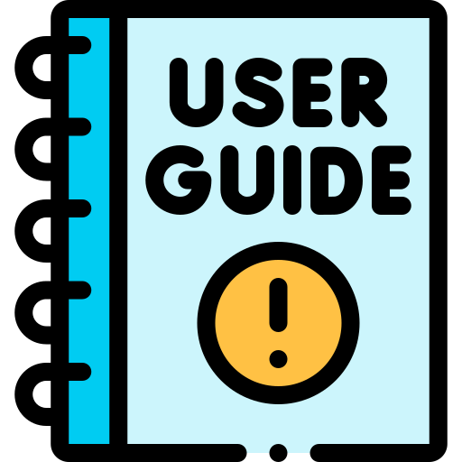

#  Pusat Panduan Pengguna Odoo (User Manual)

Selamat datang di portal dokumentasi resmi sistem ERP Odoo PT Mitra Asa Pratama. Portal ini dirancang untuk membantu Anda memahami seluruh alur kerja operasional perusahaan, mulai dari proses penjualan hingga laporan keuangan.

---

## 🚀 Pintasan Modul Utama

Pilih modul di bawah ini untuk langsung masuk ke panduan langkah demi langkah:

-    **Modul Sales**
    
    ---
    
    Panduan pembuatan penawaran harga (*Quotation*), manajemen *Pricelist*, hingga konfirmasi menjadi *Sales Order*.
    
    [Buka Panduan Sales :octicons-arrow-right-16:](sales/sales_quotation.md)

-    **Modul Inventory**
    
    ---
    
    Alur pengelolaan stok, proses penerimaan barang (*Receipts*), hingga pengiriman ke pelanggan (*Delivery*).
    
    [Buka Panduan Inventory :octicons-arrow-right-16:](inventory/inventory.md)

-    **Modul Accounting**
    
    ---
    
    Pencatatan faktur konsumen (*Invoices*), tagihan vendor (*Bills*), hingga proses rekonsiliasi bank.
    
    [Buka Panduan Accounting :octicons-arrow-right-16:](#)

---

## 💡 Tips Menggunakan Portal Ini

Untuk efisiensi kerja Anda dalam mencari informasi, manfaatkan fitur-fitur berikut:

* **Pencarian Cepat (Ctrl + F):** Gunakan kolom pencarian di bagian atas halaman untuk langsung menemukan istilah tertentu (misal: ketik *"Pricelist"* atau *"Tax"*).
* **Mode Gelap/Terang:** Klik ikon matahari/bulan di pojok kanan atas untuk kenyamanan mata Anda saat membaca dokumen.
* **Zoom Gambar:** Semua gambar *screenshot* alur Odoo di dalam panduan ini dapat diklik untuk memperbesar tampilan teks detail.

!!! note "Butuh Bantuan Tambahan?"
    Jika Anda menemukan alur sistem yang disesuaikan (*customized*) namun belum tercantum di portal ini, silakan hubungi tim **ITDS Department** untuk pembaruan dokumentasi lebih lanjut.