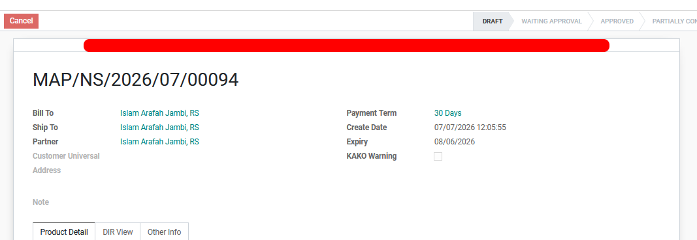
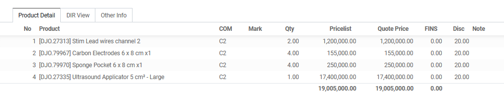
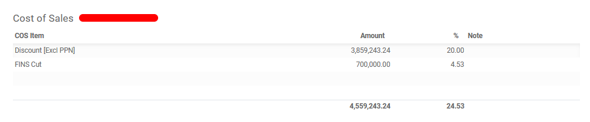
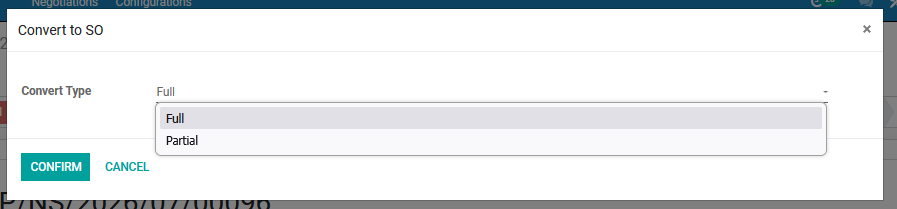

#  Alur Pembuatan Negotiation Sheet

Halaman ini menjelaskan langkah-langkah standar untuk membuat dokumen *Quotation* (Penawaran Harga) hingga menjadi *Sales Order* (SO) yang siap diproses oleh tim gudang.

## 1. Membuat Negotiation Baru

1. Masuk ke modul **Negotiation Sheet** > **Orders** > **Approval** > **Convert SO**.
2. Klik tombol **New** di pojok kiri atas halaman.
3. Isi data pelanggan pada kolom **Bill To**, **Ship To** dan **Partner**. Jika pelanggan belum terdaftar, Anda bisa mengisi pada kolom **Customer Universal**.
4. Tentukan termin pembayaran penawaran pada kolom **Payment Term**.
5. Isi **Note** jika diperlukan.

*Gambar 1 : Tampilan pengisian form pada Negotiation Sheet.*

---

## 2. Pengisian Produk dan Harga

Pada tab **Product Detail**, masukkan produk yang ingin ditawarkan kepada pelanggan:

1. Klik **Add a line**.
2. Pilih produk dari daftar *dropdown*.
3. Masukkan jumlah produk pada kolom **Qty**.
4. Sistem akan otomatis menarik harga standar, ongkos kirim, dan diskon. Anda dapat mengubah harga satuan secara manual pada kolom **Quote Price**, mengubah ongkos kirim pada kolom **FINS**, dan mengubah diskon pada kolom **Disc** jika terdapat kesepakatan khusus.
5. Isi **Note** jika diperlukan.

*Gambar 2 : Tampilan pengisian produk pada tab Product Detail.*

<!-- !!! note "Tips Pengisian Cepat"
    Anda bisa menekan tombol `Tab` pada *keyboard* untuk berpindah antar-kolom di Order Lines dengan lebih cepat tanpa perlu klik *mouse*. -->

---

## 3. Memasukkan Cost of Sales

Pada tab **Cost of Sales**, masukkan biaya yang ingin ditawarkan kepada pelanggan:

1. Klik **Add a line**.
2. Pilih biaya dari daftar *dropdown*.
3. Sistem akan otomatis menarik baya nya berdasarkan cost item yang dipilih. Ada beberapa cos item yang bisa dirubah biaya nya, maka masukkan biaya pada kolom **Amount** atau presentase nya pada kolom **%**.
4. Isi **Note** jika diperlukan.

*Gambar 3 : Tampilan cos item pada tabel Cost of Sales.*

---

## 4. Menunggu Approval

Pada state **Waiting Approval**, ada beberapa kondisi berdasarkan warna pada Negotiation Sheet yang dibuat :

1. Warna "Hijau" berarti tidak perlu meminta Approval, bisa skip pada langkah ini.
2. Warna "Biru" meminta Approval "RSM".
3. Warna "Kuning" meminta Approval "GSM".
4. Warna "Oren" meminta Approval "RSM" kemudian "GSM" dan "DIR".
5. Warna "Merah" meminta Approval "RSM" kemudian "GSM" dan "DIR".

---

## 5. Melakukan Konfirmasi menjadi Converted 

Setelah dokumen penawaran disetujui oleh pelanggan, Anda harus mengubah statusnya menjadi *Converted* agar modul *Sales* dapat mendeteksi adanya penjualan barang.

* Klik tombol **Convert To So** yang berada di barisan tombol aksi kiri atas.
* Pilih tipe convert **Full** atau **Partial**
* Status dokumen di pojok kanan atas akan otomatis berubah dari **Approved** menjadi **Converted** atau **Partially Converted**.

*Gambar 4 : Tampilan confirm Convert To SO.*

<!-- !!! warning "Peringatan Penting Sebelum Konfirmasi"
    Pastikan Anda telah memeriksa ulang nilai pada Tabel **Calculation** dan **Warna** yang tertera. Dokumen yang sudah berstatus *Converted* maka sudah bisa lanjut pada modul **Sales**. -->

## 📝 Referensi Tambahan

### SOP Harian (Checklist)
* <input type="checkbox"> **Pastikan Nama Customer (Bill To - Ship To - Partner - Customer Universal)** sudah sesuai dan benar.
* <input type="checkbox"> **Memastikan Produk dan Quantity serta Diskon atau potongan harga dan ongkir** sudah sesuai dengan kebutuhan customer/pembeli.
* <input type="checkbox"> **Pastikan Bagian COS (Cost of Sales)** sudah sesuai dengan kesepakatan.

### Fitur Berdasarkan Hak Akses
=== "Admin SAS"
    - Dapat membuat *NS* baru dan dapat melihat keseluruhan data pada modul.
    - Dapat melakukan action *Submit* jika penawaran sudah sesuai 
    - Dapat melakukan action *Convert to SO* jika sesuai selesai tahap Approval

=== "DIR"
    Memiliki tombol untuk menyetujui diskon di luar batas standar dan mengubah *APPROVE* khusus (*Merah atau Orange*).
    Memiliki tampilan Tab perhitungan 

=== "GSM"
    Memiliki tombol untuk menyetujui diskon di luar batas standar *APPROVE* khusus (*Kuning*).

=== "RSM"
    Memiliki tombol untuk menyetujui diskon di luar batas standar *APPROVE* khusus (*Biru*).

=== "ASM"
    Memiliki tombol untuk menyetujui diskon di luar batas standar *Hanya dapat melihat area masing-masing*.

??? info "What Next?"
    Setelah *NS* sudah dilakukan *Convert to SO* selanjutnya dokumen akan masuk ke Modul *Sales* selanjutnya dokumen akan masuk ke Modul *Sales*.
    [Lanjut ke Modul Sales:octicons-arrow-right-16:](../sales/sales_quotation.md)